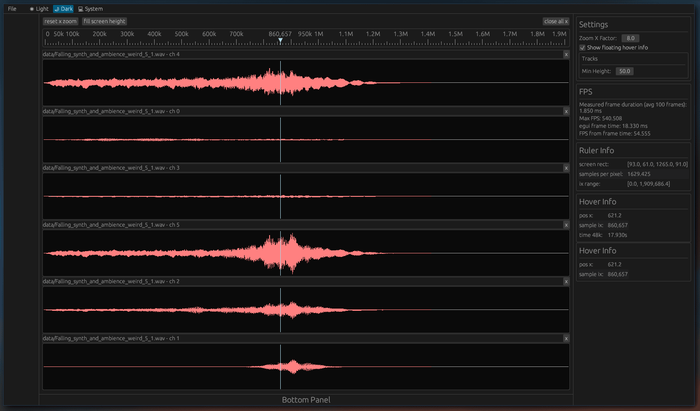

# Wavalyze

[](https://github.com/frydac/wavalyze/actions/workflows/rust.yml)
[](https://github.com/frydac/wavalyze/actions/workflows/pages.yml)

**Wavalyze** is a WAV file viewer with a long-term goal of becoming a full analysis and diff tool for audio software development.

It is a personal Rust learning project, focused on visual inspection of waveforms and low-level audio data, built on `egui`.



## Demo

Web demo: [frydac.github.io/wavalyze](https://frydac.github.io/wavalyze/)

## CLI

See [CLI arguments](doc/cli_args.md).

## Features (current)

- Multi-track waveform display
- Zoom and pan on the time axis
- Hover inspection of sample data

## Local dev

Native:
```
cargo run --release
```

Web (WASM):
```
rustup target add wasm32-unknown-unknown
cargo install --locked trunk
trunk serve
```

Open `http://127.0.0.1:8080/index.html#dev` to bypass the service worker cache during development.

## Updating egui

As of 2023, egui is in active development with frequent releases with breaking changes. [eframe_template](https://github.com/emilk/eframe_template/) will be updated in lock-step to always use the latest version of egui.

When updating `egui` and `eframe` it is recommended you do so one version at the time, and read about the changes in [the egui changelog](https://github.com/emilk/egui/blob/master/CHANGELOG.md) and [eframe changelog](https://github.com/emilk/egui/blob/master/crates/eframe/CHANGELOG.md).
