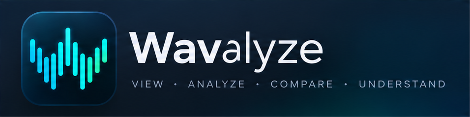
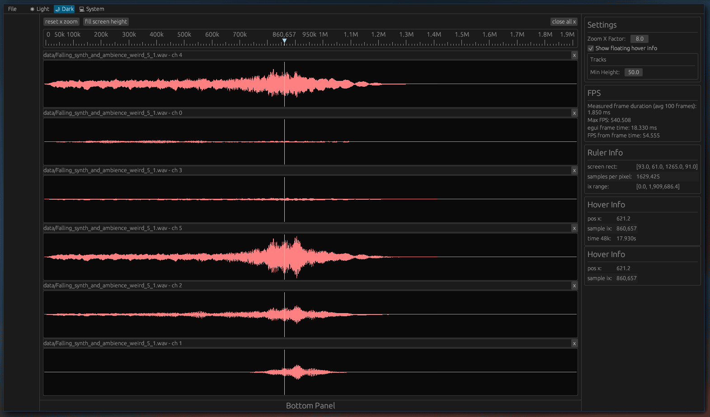

# Wavalyze

[](https://github.com/frydac/wavalyze/actions/workflows/rust.yml)
[](https://github.com/frydac/wavalyze/actions/workflows/cloudflare-pages.yml)



**Wavalyze** is a WAV file viewer with the goal of becoming an analysis and diff tool useful for (my personal) audio software development.

I started this project to learn about Rust and WebAssembly, and to have a tool that is faster to do
what I want to do than the freely available alternatives.




## WASM Web Demo

A WebAssembly build of the Wavalyze application hosted on cloudflare:  
[wavalyze.emile-vrijdags-github.workers.dev](https://wavalyze.emile-vrijdags-github.workers.dev/)

## Docs

- [Mouse navigation](doc/mouse_navigation.md)
- [CLI arguments](doc/cli_args.md)
- [Cloudflare deploy notes](doc/cloudflare_deploy.md)

## Features

- Multi-file waveform viewing
- Fast startup for quick file inspection
- Zoom and pan over x and y axes with multiple types of controls
   - see [Mouse navigation](doc/mouse_navigation.md)
- Sample-level hover details
- Calculate track statistics (dB-RMS, peak) over a selection
  - Visual indication of peak value in selection
- Diff files/tracks, with offset adjustment
- Show/hide tracks with auto adjusting track height for filling the screen
- Native and browser builds

Non-goals:

- Audio playback (simple stereo playback likely at some point)
- Audio editing (probably never)

## Installation

### macOS

Build and install `Wavalyze.app` for the current user:

```bash
./scripts/install-macos.sh
```

The app is installed in `~/Applications`. The installer also creates the `wv` command in `~/.cargo/bin`.

To update an existing installation:

```bash
git pull
./scripts/install-macos.sh
```

Launch the app from Finder or the command line:

```bash
open "$HOME/Applications/Wavalyze.app"
wv --help
wv recording.wav
```

### Other platforms

No packaged installers are available. Build or run Wavalyze from source with Cargo:

```bash
cargo build --release
cargo run --release
```

## Local development

Native:

```bash
cargo run --release
```

Web (WASM):
```
rustup toolchain install nightly-2026-01-15 --target wasm32-unknown-unknown --component rust-src
cargo install --locked trunk
./scripts/trunk-threaded.sh serve
```

Open `http://127.0.0.1:8080/index.html#dev` to bypass the service worker cache during development.

### Browser settings

Configuration persistence is currently native-only. In the browser, setting changes apply to the current app session but are not saved and reset when the page is reloaded.

## CI

The main workflows are:

- [`rust.yml`](.github/workflows/rust.yml): native checks, tests, linting, cross-target builds, and threaded wasm validation
- [`cloudflare-pages.yml`](.github/workflows/cloudflare-pages.yml): production web build and deploy to Cloudflare Workers static assets

For a local CI-like run, use:

```bash
./check.sh
```

## Repository layout

- `src/`: Rust application, UI, model, audio, WAV loading, and WASM entrypoints
- `tests/`: integration tests grouped by subsystem
- `assets/`: icons, manifest, service worker, and other files copied into the web build
- `web/`: web hosting support files, including `_headers` for Cloudflare/COOP/COEP headers
- `scripts/`: project helper scripts, including the Trunk wrapper used for threaded WASM builds
- `doc/`: project notes, diagrams, screenshots, and generated CLI documentation
- `dev/nix/`: optional Nix development shell definition
- `.github/`: CI and deployment workflows
- `.cargo/`: Cargo configuration

Important root files:

- `Cargo.toml` / `Cargo.lock`: Rust package manifest and locked dependency graph
- `index.html` / `Trunk.toml`: Trunk web build entrypoint and configuration
- `wrangler.jsonc`: Cloudflare Workers static-assets deploy configuration
- `rust-toolchain` / `rustfmt.toml`: pinned Rust toolchain and formatting settings
- `check.sh`: local CI-like check script
- `.typos.toml`: spell-check configuration

Generated or local-only paths such as `target/`, `dist/`, `data/`, `perf.data*`, and `tags` are ignored by Git.

Optional Nix shell:

```bash
nix develop ./dev/nix
```
